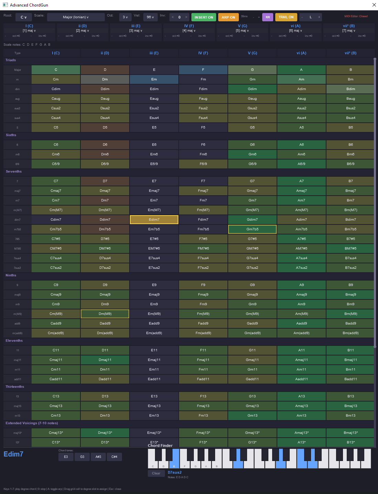

# Advanced ChordGun

An expanded chord composition tool for REAPER, inspired by Pandabot's ChordGun.
50+ chord types, intelligent next-chord suggestions, and humanized arpeggiation
for sketching out complex harmony fast.

## Features

- **50+ chord types** — triads, 6ths, 7ths, 9ths, 11ths, 13ths, altered dominants (7b9, 7#9, 7alt, 7b5b9, 7#5#9), half-diminished, m(maj7), maj7#5, and extended jazz voicings up to 10 notes
- **Full scrollable chord grid** showing every chord type on every scale degree at once, organized by category (Triads, Sixths, Sevenths, Ninths, Elevenths, Thirteenths, Altered Dominants, Extended Voicings)
- **Next-chord suggestion engine** — after you play any chord, the grid lights up with green/yellow/orange tints showing which chords would sound good as the next move, based on shared pitch classes and root movement quality
- **Current chord highlight** — whatever you just played lights up gold so you always know where you are on the grid
- **Trailing chord history** — the previous 7 chords show fading gold borders behind the current one, so you can see your harmonic path through the grid as you sketch (toggleable)
- **Arpeggiate mode** — plays chord notes one at a time instead of as a block chord, with adjustable delay (10-120ms), applies to both live preview and inserted MIDI
- **Round Robin humanize** — randomizes per-note timing (40%-180% of base delay) and velocity for an organic, hand-played feel
- **Per-degree key bindings** — each of the 7 scale degrees has its own dropdown to assign any chord type to its number key independently, so you can set key 1 = maj9, key 2 = m11, key 5 = 13, etc.
- **Diatonic chord row auto-highlights** for whichever scale you're in
- **7 modes supported** — Ionian, Dorian, Phrygian, Lydian, Mixolydian, Aeolian, Locrian, with Roman numeral degree headers updating per mode
- **Live MIDI preview** through whatever instrument you have armed
- **Insert mode** drops chords directly into the active MIDI editor at the cursor, advancing by grid size
- **Inversion control** (-4 to +4)
- **Dropdowns for all top controls** — root, scale, octave, velocity
- **Clickable note buttons** for the played chord — every note (even in 10-note voicings) appears as a clickable button to audition or insert individually
- **All settings persist with the project**

## Installation

1. Download `AdvancedChordGun.lua` from this repo
2. In REAPER, go to **Actions → Show action list**
3. Click **New action → Load ReaScript...**
4. Select the downloaded file
5. Run it from the action list (search "AdvancedChordGun")

## Keyboard Shortcuts

- `1-7` — Play assigned chord for that scale degree
- `0` — Stop all notes
- `A` — Toggle arpeggiate
- `Up/Down` — Scroll grid
- `Esc` — Close

## License

MIT
